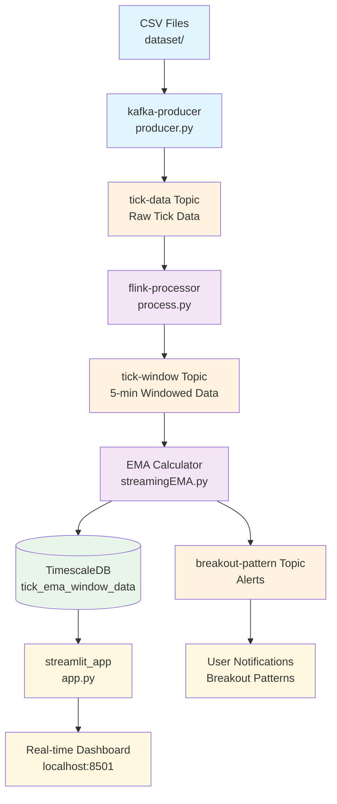

# DEBS2022-Detecting-Trading-Trends-in-Financial-Tick-Data

A real-time financial tick data processing system that detects trading trends and breakout patterns using Apache Kafka, Apache Flink, TimescaleDB, and Streamlit.

## Data Flow Architecture

### 1. Data Ingestion
- **Source**: Download the dataset[https://zenodo.org/records/6382482] and create a folder `seed/dataset` to place all of the dataset.
 ```
kafka-producer/
├── producer.py # Main Kafka producer that reads CSV data
├── seed.sh # Script to seed data from CSV files
├── test.py # Testing script for the producer
├── requirements.txt # Python dependencies
├── Dockerfile # Docker configuration for the producer
└── seed/
    └── dataset/ 
        ├── debs2022-gc-trading-day-14-11-21.csv
        ├── debs2022-gc-trading-day-15-11-21.csv
        └── ...
```
- **Producer**: `kafka-producer/producer.py` reads CSV files and publishes to Kafka topic `tick-data`
- **Data Format**: Raw tick data with timestamps and price information

### 2. Stream Processing (Apache Flink)
- **Input Topic**: `tick-data` (raw tick data)
- **Processing**: 
  - Aggregates data into 5-minute windows
  - Extracts the last value from each window
- **Output Topic**: `tick-window` (windowed data)

### 3. Technical Analysis
- **Input Topic**: `tick-window` (5-minute windowed data)
- **Calculations**:
  - **EMA38**: 38-period Exponential Moving Average
  - **EMA100**: 100-period Exponential Moving Average
- **Pattern Detection**: Identifies breakout patterns
- **Output Topic**: `breakout-pattern` (alerts for detected patterns)
- **Storage**: Results stored in TimescaleDB table `tick_ema_window_data`

### 4. Real-time Dashboard (Streamlit)
- **Data Source**: TimescaleDB database
- **Visualization**: 
  - Line charts showing tick data, EMA38, and EMA100
  - Real-time updates with configurable refresh intervals
  - Interactive symbol selection and search functionality

## Technology Stack

- **Message Queue**: Apache Kafka
- **Stream Processing**: Apache Flink
- **Database**: TimescaleDB (PostgreSQL with time-series extensions)
- **Dashboard**: Streamlit
- **Containerization**: Docker & Docker Compose
- **Data Format**: CSV files with financial tick data

## Key Features

- **Real-time Processing**: Continuous stream processing of financial data
- **Technical Indicators**: EMA38 and EMA100 calculations
- **Pattern Detection**: Breakout pattern identification
- **Interactive Dashboard**: Real-time visualization with UTC time display
- **Scalable Architecture**: Microservices-based design with Docker containers
- **Data Persistence**: Time-series optimized database storage

## Getting Started

1. **Start the system**:
   ```bash
   docker compose up -d --build
   ```

   When kafka and flink-jobmanager are running, run this code to process the flink job:
    ```bash
   docker compose exec flink-jobmanager flink run -py /opt/flink/process.py
   ```

   And the second job to calculate EMAs:
   ```bash
   docker compose exec flink-jobmanager flink run -py /opt/flink/streamingEMA.py
   ```

2. **Access the dashboard**:
   - Streamlit: http://localhost:8501
   - Flink UI: http://localhost:8081

3. **Monitor the data flow**:
   - Database migrations run automatically
   - Kafka producer seeds data from CSV files
   - Flink processes data in real-time
   - Streamlit dashboard displays results

## Data Pipeline Summary



### Detailed Flow Description

1. **Data Ingestion** (Blue)
   - CSV files in `dataset/` folder contain raw tick data
   - `kafka-producer` reads and publishes to `tick-data` topic

2. **Stream Processing** (Orange)
   - Apache Flink consumes from `tick-data` topic
   - Aggregates data into 5-minute windows
   - Publishes windowed data to `tick-window` topic

3. **Technical Analysis** (Purple)
   - EMA calculator processes windowed data
   - Calculates EMA38 and EMA100 indicators
   - Detects breakout patterns

4. **Data Storage** (Green)
   - Results stored in TimescaleDB table
   - Optimized for time-series data

5. **User Interface** (Yellow)
   - Streamlit dashboard reads from database
   - Real-time visualization of indicators
   - Breakout pattern alerts sent to users
